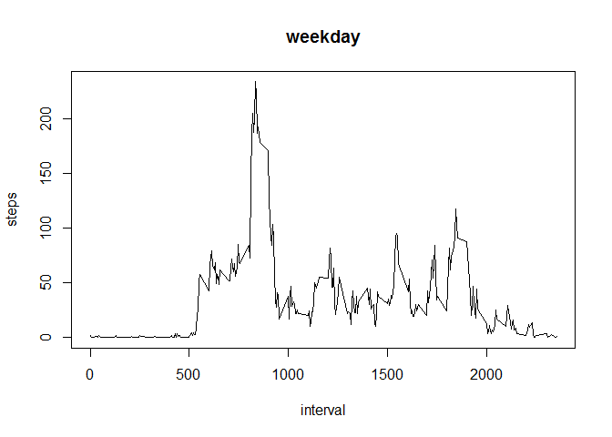

# Reproducible Research Assignment 1
NN  
June 2, 2016  
##Loading and preprocessing the data
1. Load the data into R

```r
dt<-read.csv("activity.csv", header = TRUE, as.is = TRUE)
```

##What is mean total number of steps taken per day?
2. Histogram of the total number of steps taken each day

```r
daily_steps<-aggregate(steps ~ date, dt, sum)
hist(daily_steps$steps, main = "Histogram of the total number of steps taken each day", xlab = "Steps")
```

<!-- -->

3. Mean and median number of steps taken each day

```r
mean(daily_steps$steps)
```

```
## [1] 10766.19
```

```r
median(daily_steps$steps)
```

```
## [1] 10765
```

##What is the average daily activity pattern?
4. Time series plot of the average number of steps taken

```r
average_interval_steps <- aggregate(steps ~ interval, dt, mean)
plot(average_interval_steps$interval, average_interval_steps$steps, type = "l", xlab = "Time Interval", ylab = "Avg number of steps", main = "Average Number of Steps at Interval")
```

<!-- -->

5. 5-minute interval that, on average, contains the maximum number of steps

```r
max_avg_steps_row<-which.max(average_interval_steps$steps)
print(paste("Interval with highest average number of steps:", average_interval_steps[max_avg_steps_row,]$interval))
```

```
## [1] "Interval with highest average number of steps: 835"
```

```r
print(paste("Highest average number of steps:", average_interval_steps[max_avg_steps_row,]$steps))
```

```
## [1] "Highest average number of steps: 206.169811320755"
```

##Imputing missing values
6. Total number of missing values in the dataset

```r
number_missing<-dt[!complete.cases(dt),]
nrow(number_missing)
```

```
## [1] 2304
```

7. Fill in missing values with the median for that interval

```r
dt_complete<-dt
dt_complete$steps[is.na(dt_complete$steps)]<-median(dt_complete$steps[dt_complete$interval], na.rm = TRUE)
```
Histogram with imputed steps:

```r
daily_steps_impute<-aggregate(steps~date, dt_complete, sum)
hist(daily_steps_impute$steps, main = "Histogram of the total number of steps taken each day-blanks imputed",xlab = "Steps")
```

<!-- -->

```r
mean_steps<-mean(daily_steps_impute$steps)
print(paste("Mean number of steps after imputing missing values:", mean_steps))
```

```
## [1] "Mean number of steps after imputing missing values: 9354.22950819672"
```

```r
median_steps<-median(daily_steps_impute$steps)
print(paste("Median number of steps after imputing missing values:", median_steps))
```

```
## [1] "Median number of steps after imputing missing values: 10395"
```

```r
print("Imputing the number of steps has reduced both the mean and median number of steps per day")
```

```
## [1] "Imputing the number of steps has reduced both the mean and median number of steps per day"
```

##Are there differences in activity patterns between weekdays and weekends?
8. Panel plot comparing the average number of steps taken per 5-minute interval across weekdays and weekends


```r
#Create a new factor variable in the dataset with two levels - "weekday" and "weekend" indicating whether a given date is a weekday or weekend day
day <- function(date) {
    if (weekdays(as.Date(date)) %in% c("Saturday", "Sunday")) {
        "weekend"
    } else {
        "weekday"
    }
}
dt$day <- as.factor(sapply(dt$date, day))

#Make a panel plot containing a time series plot (i.e. type = "l") of the 5-minute interval (x-axis) and the average number of steps taken, averaged across all weekday days or weekend days (y-axis)

for (type in c("weekend", "weekday")) {
    steps.type <- aggregate(steps ~ interval, data = dt, subset = dt$day == type, FUN = mean)
    plot(steps.type, type = "l", main = type)
}
```

<!-- --><!-- -->
`
